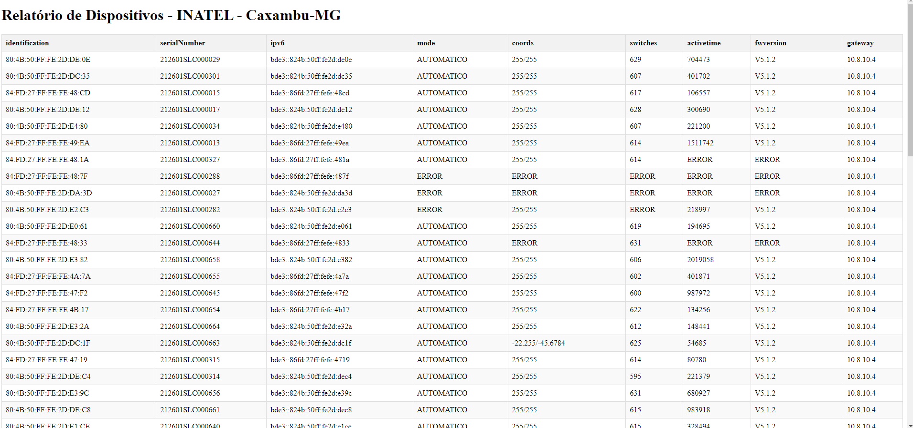

# Mapeador de Dispositivos de Iluminação Pública 🛠️🌍

Este projeto é uma aplicação **NodeJS** que tem como objetivo mapear todos os dispositivos de um parque de iluminação pública pré-definido, coletar suas informações via o servidor **NLM Pro**, conectar-se aos concentradores do parque e solicitar dados de cada dispositivo. Isso possibilita a identificação de possíveis falhas e configurações incorretas.



---

## 📋 Requisitos

- **NodeJS** versão **22.9.0** ou superior
- Conexão com a **VPN da Nouvenn**

---

## ⚙️ Instalação

1. **Instalar dependências**:
   ```bash
   npm install
   ```

2. **Certifique-se de que não há arquivos CSV** de projetos anteriores na pasta para evitar conflitos no relatório.

---

## 🚀 Uso

### 1. Listar Projetos
Execute o comando para listar todos os projetos cadastrados e seus respectivos identificadores:
```bash
npm run projects
```

Um arquivo CSV chamado `projetos.csv` será gerado, listando todos os projetos e seus IDs.

### 2. Configurar o Projeto
- **ID do Projeto**: Copie o ID do projeto gerado no CSV e cole no arquivo `.env` na variável `ID_DO_PROJETO`.
- **Prefixo**: Defina o prefixo dos concentradores na variável `PREFIXO_DO_PROJETO`.
   - _(Nota: Dispositivos conectados a concentradores com prefixos incorretos não responderão adequadamente)._
- **Média de Chaveamentos**: Defina a média de chaveamentos adequada na variável `MEDIA_CHAVEAMENTOS_ADEQUADA`.

### 3. Gerar o Relatório
Após configurar o arquivo `.env`, execute o comando:
```bash
npm run report
```
> ⚠️ **Atenção**: Para parques grandes, a geração do relatório pode demorar várias horas.

---

## 🗂️ Saída

Após a geração do relatório, um arquivo **HTML** será criado e poderá ser aberto em qualquer navegador. O relatório destacará dispositivos com falhas ou mal configurados, seguindo as seguintes regras:

- **Chaveamentos Excessivos**: Dispositivos cujo número de chaveamentos exceda **5 vezes** a média definida.
- **Modo Astronômico Mal Configurado**: Dispositivos no modo Astronômico sem `lat/lng` configurados.

---

## 🛠️ Dicas e Solução de Problemas

- Certifique-se de que está conectado à **VPN da Nouvenn** antes de executar os comandos.
- Verifique se não há arquivos CSV antigos antes de gerar um novo relatório.
- Utilize **NodeJS v22.9.0** ou superior para garantir a melhor compatibilidade.

---

## 👥 Contribuidores

- [Wesley RIbeiro Barbosa] - Desenvolvimento e documentação.

---
